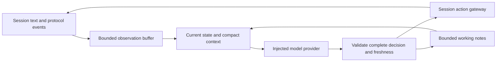

# Proposal: a world-aware agent workspace

**Status:** Broader design proposal. A first implementation now ships with per-world Agent settings and live controls in the Automation menu. See [current functionality and setup](../agent.md); multiple presets, global connections, typed actions and persistent memory below remain proposed.

**Initial target:** the user's local Gemma 12B model served by LM Studio. The exact model identifier, quantization, context capacity and output capabilities will be discovered or configured during testing.

## Recommendation

Add a native **Agent** bottom tab inside each open MUD session. Configure its behavior and command vocabulary per world, give it a goal, and let it operate through a bounded observe → decide → act → observe loop. Keep the prompt compact by supplying current state and a small working memory rather than replaying the entire transcript.

Wandur owns the execution loop. JavaScript can eventually supply game-specific observations and actions, but a player should be able to configure and run the first version without writing code.

The initial implementation uses the OpenAI-compatible Chat Completions API. Provider-specific request formats stay behind an injected adapter; neither the UI nor the agent loop depends on OpenAI message classes, tool-call formats or conversation IDs.

### Approaches considered

| Approach | Advantages | Costs | Decision |
| --- | --- | --- | --- |
| Native agent with optional script extensions | Discoverable UI; shared command, cancellation and context rules; works without coding | Requires a small native orchestration subsystem | Recommended |
| JavaScript script that calls an LLM | Flexible and close to existing triggers | Every script must handle network calls, stale decisions, memory and stopping; network access changes the current scripting boundary | Future extension, not the initial foundation |
| Separate agent process using MCP or a custom bridge | Independent clients and server-side experiments become possible | More setup, authentication, event delivery and lifecycle work | Defer until the in-client behavior works |

## The first experience

1. Connect and log in normally. Choose the session’s **Agent** bottom tab (to be implemented).
2. Choose a saved world agent profile, or create one. Pick the LM Studio connection and its actual Gemma model ID.
3. Enter a goal and review the enabled command catalog. A starter goal could be “Explore five new rooms and stop.”
4. Use **Preview** to see one proposed decision without sending a game command, **Step** to execute one decision, or **Run** for a bounded autonomous attempt.
5. See what the agent observed, what it chose, the command actually sent, and the observed outcome. Pause or take over through the normal command box at any time.

No per-command approval is required in Run mode. Choosing Run authorizes the enabled catalog within the configured run limits. The agent never starts automatically when a world connects or the app restarts.

## UI proposal

Put saved agent configuration in a future **Agent** section of the world configuration window. Keep live start/stop/status controls in the connection’s **Automation** menu; a larger activity view can be added when needed. The current session footer contains **Play · Diagnostics**. The Workspace sidebar lists open connections separately from saved worlds. Each open connection has a unique session ID and an optional user label. Several connections may use the same saved profile with manually entered, different credentials. Agent execution binds to the open session ID, never merely a hostname or saved profile ID. Agent configuration and execution remain proposed. Scripts and macros are edited in world configuration.

Keep a compact, flat toolbar and a left-hand section list. Inherit world theme resources; avoid a separate chat-app visual style. All UI labels, validation and status text use the existing localization resources for English, Spanish, French, German and Brazilian Portuguese. User-authored prompts and game text remain untranslated.

```text
┌ Agent — Legends of the Jedi ──────────────────────────────────────────────┐
│ Profile: Explorer ▾        Preview   Step   Run ▶   Pause ⏸   Stop ■     │
├──────────────┬────────────────────────────────────────────────────────────┤
│ Run          │ Goal                                                       │
│ Behavior     │ Explore five new rooms, then stop.                         │
│ Commands     │                                                            │
│ Memory       │ Paused · LM Studio / selected Gemma model                  │
│ Connection   │ 2 / 5 rooms · 6 decisions · 2m 10s                         │
│              │                                                            │
│              │ Activity                                                   │
│              │ Observed   Passenger Bunks · room 562 · north exit         │
│              │ Decision   Move north to inspect the cockpit              │
│              │ Sent       north                                           │
│              │ Result     Arrived in room 561                             │
├──────────────┴────────────────────────────────────────────────────────────┤
│ Context ~2,100 / 4,096 input tokens · Last response 3.4s · Local endpoint  │
└──────────────────────────────────────────────────────────────────────────┘
```

Numbers and activity above are illustrative, not measurements of the user's model.

### Sections

- **Run:** goal, optional measurable stop condition, limits, current progress and a bounded activity list. Selecting an entry reveals the exact redacted observation bundle, decision, rendered command and result. A short model-supplied reason is visible; internal chain-of-thought is not requested or stored.
- **Behavior:** world-specific system instructions, play style, observations to include, and idle behavior. The goal is separate from the reusable prompt. Show an expandable preview of the effective request.
- **Commands:** compact editable list of action name, description, command template, typed arguments, enabled state and expected outcome. “Known to the model” and “allowed to execute” are distinct settings.
- **Memory:** current state, working notes and user-pinned facts. Show provenance and age. Edit or clear notes while paused; reset a goal without deleting the world profile. Present unknown values honestly.
- **Connection:** select a global provider connection and model; test it or open provider settings. Context/output limits and response format are visible here. Do not repeat API keys in each world profile.

Global **Settings → AI connections** stores reusable endpoints. The existing section-list settings layout is appropriate. The terminal session shows a small clickable status such as **Agent: running** so hiding the Agent document does not hide ongoing activity.

Leaving the Agent tab only hides it; closing its session stops the run. Switching tabs does not redirect it. Editing behavior, commands, model or goal during a run first pauses that run and invalidates any pending decision.

## World profiles and command catalogs

A world may have several named profiles, such as Explorer and Crafter. Only one agent may control a particular session at once. Profile definitions use the existing stable world identity, so renaming a world or editing its hostname does not orphan them.

Each catalog entry describes an action the model can select. Wandur renders the actual command from that entry; the model does not return an executable script.

| Action ID | Purpose | Arguments | Command | Expected evidence |
| --- | --- | --- | --- | --- |
| `look` | Inspect the current room | None | `look` | New room text or configured response boundary |
| `move` | Take a directional exit | `direction`: configured enum | `{direction}` | Changed room ID, explicit failure, or configured text evidence |
| `inventory` | Inspect carried items | None | `inventory` | Response text |
| `inspect` | Inspect an object | `target`: bounded single-line text | `look {target}` | Response text |

These are starter examples, not claims that every MUD supports those commands. The user edits them per world. Include command examples and constraints in the prompt only for the selected catalog. Disabled actions can remain documented as unavailable vocabulary.

The executor validates the action ID and arguments, renders one command, and applies the world's command grammar. Reject line breaks, control characters and command chaining outside that grammar. Do not accept arbitrary command strings, JavaScript, shell commands or endpoint changes from the model. A short default catalog keeps decisions and context manageable.

Send agent actions through a dedicated session action gateway which shares the existing send validation, privacy checks, mapper command tracking and connection lifetime. It must not bypass those checks by writing directly to `IMudSession`. Rendered agent commands bypass user alias expansion so their meaning matches the reviewed catalog; future script actions are registered explicitly.

Give dispatched commands a trusted source identity (manual, agent, script or map walker). This lets manual takeover pause the agent without its own commands pausing it. Source identity is assigned by Wandur, never by model output.

Movement uses the same rule as manual play: the sent direction plus the subsequent room observation establishes a traversal. A protocol relocation without a paired direction changes location without inventing an exit. The model cannot declare a movement successful or edit the map by claiming it reached a room.

## Runtime behavior



### Scheduling

- One model decision in flight per run and one game command outstanding. Start with one inference request at a time per provider connection, suitable for a locally hosted 12B model. Other sessions display **Waiting for model**; stale queued observations are rebuilt before dispatch.
- Wake on relevant room/state changes, completion of the previous action, an explicit Step/Run, or an optional bounded idle timer. Aggregate text bursts rather than calling the model for every line.
- Begin with a configurable 500 ms settling window and a 2 second minimum action interval. A quiet interval is a batching heuristic, not proof that a command completed.
- Correlate protocol room changes, available prompt boundaries and world-configured success/failure patterns with the outstanding action. Text-only games remain usable, but uncertain results stay uncertain. On timeout, pause with the last evidence instead of blindly replaying the command.
- A `wait` decision sleeps until relevant input or its bounded wake time. Do not repeatedly send `look` or call the model while nothing has changed. A run can opt into a 30 second idle wake; it is off by default.

Initial Run defaults: stop after goal completion, 30 decisions, or 10 minutes, whichever occurs first. These are adjustable limits, not promises about inference speed. A stop condition such as “five new rooms” is checked against observed map state. An open-ended goal can finish on the model's judgment, visibly labeled as such.

### States and interruption

States are **Stopped**, **Ready**, **Waiting for model**, **Thinking**, **Acting**, **Waiting for result**, **Paused**, **Completed**, and **Error**. The UI shows the reason when paused or stopped.

- **Preview:** produce a proposed decision, send nothing, and do not commit its working-memory updates.
- **Step:** make at most one decision and send at most one command, wait for its result or timeout, then pause.
- **Run:** continue the same loop within the goal and limits.
- **Pause:** cancel inference and future dispatch; preserve goal and memory. Continue receiving observations. An already-sent command may still complete.
- **Stop:** end the run and invalidate its pending work. Keep the last state visible for inspection; starting another run is explicit.
- Manual input takes control and pauses the agent before the command is sent. Disconnect, reconnect, login/private input and session disposal cancel the run's outstanding work. Reconnection requires an explicit resume after fresh observations.

Stamp requests with run ID, session generation, profile revision, privacy epoch and observation revision. Recheck them at dispatch. If relevant state changed while the model was thinking, discard the stale action and rebuild context. Unrelated chat should not invalidate an action. Repeated invalidation is bounded by run limits and reported, rather than becoming a hidden busy loop.

The first version gives Step and Run exclusive automation control of that session: pause sending scripts and the map auto-walker while they own the session. Show which automation is suspended. Manual commands always take priority. Release ownership when paused, stopped or completed; restore previously enabled script state without replaying missed commands or resuming an interrupted map walk. Future cooperating scripts must use the same action gateway and source attribution.

## Minimal context and memory

Treat the model as a stateless decision service. Wandur assembles a fresh bounded request each time; it does not accumulate an unlimited chat history or rely on provider-hosted conversation state.

Proposed starting budget: **4,096 input tokens and 512 output tokens**, subject to the model's configured context capacity. Include message and schema overhead in those limits and leave a margin. These are tunable defaults to measure on the user's Gemma setup.

| Context portion | Content and retention |
| --- | --- |
| Operator rules, world behavior and catalog | Stable instructions and enabled actions; never silently remove execution constraints to fit |
| Current goal | Objective, user-pinned requirements and observed progress |
| Current state | Room ID/name, exits, relevant nearby map, selected vitals/inventory fields, freshness and uncertainty |
| Working memory | A short summary, relevant learned facts, current subgoal and unresolved questions |
| Recent evidence | Normally the last 3–5 action/outcome pairs plus the current response; trim older entries first |

Allocate the budget dynamically. If the prompt/catalog alone cannot fit, show a configuration error. If no exact tokenizer is available, label counts as estimates, use a conservative size margin, and handle a provider context-limit error by trimming optional evidence once. Never cut a JSON document or an action schema mid-field.

Structured state takes priority over prose guesses. Reuse the mapper's current room and topology, but do not send the entire map. Vitals and inventory use explicit per-world field mappings where available; their cross-MUD normalization is not already solved by the current room decoder. Without mappings, supply a small relevant text excerpt with unknown fields left blank.

Strip ANSI for observations. Keep partial prompts and response boundaries separate from complete lines. Exclude unrelated public channels by default, with per-world inclusion controls for goals that need conversation. Never include private/login output, saved credentials, API tokens or another session's transcript. Privacy filtering happens before context buffering, including fragmented protocol/text input.

Build the session gateway on the privacy-tagged `TextReceived` and `ProtocolMessageReceived` streams. The existing untagged `Output` and `RoomReceived` events are insufficient as agent privacy boundaries. Do not scrape the rendered terminal or Diagnostics view to construct context. Only project map/state observations eligible for this run's public context.

Bound working memory to a proposed 768 tokens within the total input budget. Let a decision propose a replacement summary and a few facts with observation references. Validate and cap them; the model cannot overwrite authoritative state, pinned instructions or the goal. Mark model notes as notes, not verified world facts. Commit notes only for an accepted fresh decision, and never record a proposed command as successfully executed before observing its result.

Keep character-sensitive memory run-local by default. Optional remembered notes are scoped by world, profile and an explicit character label; never infer a shared identity from two sessions using the same host. Pinned world instructions can be shared across characters. New runs start fresh unless the user selects a saved memory checkpoint.

No vector database, embeddings, second summarizer model or automatic long-term transcript archive in the first version.

## Model decision format

Use a small discriminated result: **act**, **wait**, **complete**, or **ask_user**. `ask_user` pauses and displays the question in the Agent document. An action selects an entry from the catalog.

Illustrative provider-neutral decision:

```json
{
  "kind": "act",
  "action_id": "move",
  "arguments": { "direction": "north" },
  "reason": "Inspect the unexplored north exit.",
  "memory": {
    "summary": "Exploring the shuttle. Current observed room is 562.",
    "subgoal": "Inspect the next room."
  }
}
```

The actual schema is versioned, bounded and validated locally, including action-specific arguments. No command is dispatched from partial streaming output, malformed JSON, an unknown action or a truncated completion. One repair request is allowed for invalid output; repeated invalid output pauses with an inspectable error. JSON formatting success does not imply a sensible action, so normal execution and freshness checks still apply.

## Provider architecture and LM Studio setup

### First adapter

Implement **OpenAI-compatible Chat Completions** using an injected HTTP client and typed internal DTOs. It supports a configurable API base URL, optional bearer-token reference, explicit model ID, cancellation, timeouts, usage reporting when available and bounded response sizes.

For LM Studio, propose `http://localhost:1234/v1` as the editable default. Use `GET /models` relative to that base to populate choices, with manual model entry if listing is unsupported. Use the model's returned identifier rather than hard-coding a guessed Gemma name. LM Studio documents `/v1/models` and `/v1/chat/completions` among its compatibility endpoints. [LM Studio compatibility documentation](https://lmstudio.ai/docs/developer/openai-compat)

**Test connection** performs a non-game request using the selected model and decision format. It reports endpoint reachability, model response, elapsed time and whether output parsed correctly. Model availability and suitable context limits must be checked on the actual installation. No model request is needed merely to edit a profile.

Start with non-streaming requests for the short decision document. Support JSON Schema output when the selected connection/model can use it; LM Studio documents schema-constrained output, with model-dependent limitations. Provide an explicit validated-JSON text mode for endpoints without that feature. A failed capability test must not silently change the endpoint or grant broader execution. [LM Studio structured output](https://lmstudio.ai/docs/developer/openai-compat/structured-output)

Native function calling is not required for the first version. LM Studio exposes tool calling, but that alone does not prove the user's particular Gemma model will perform it reliably. The same internal decision can later be mapped to provider tool calls. [LM Studio tool use](https://lmstudio.ai/docs/developer/openai-compat/tools)

Use Chat Completions as the compatibility baseline for this local experiment; this is not a claim that it is the preferred API for every OpenAI-hosted application. Keep response-format, completion-limit and usage differences in the adapter's explicit compatibility options. [OpenAI Chat API reference](https://developers.openai.com/api/reference/resources/chat)

### Boundaries

| Component | Responsibility |
| --- | --- |
| `IAgentModelProvider` | Provider-neutral request/response, model discovery and capability testing; no game command access |
| `OpenAiCompatibleProvider` | HTTP/authentication, wire DTOs, output-format translation, finish/error/usage handling |
| `AgentRunner` | Session-scoped state machine, limits, cancellation, serialized decisions and result waiting |
| `AgentContextBuilder` | Bounded observations, state projection, context budgeting and memory validation |
| `IAgentSessionGateway` | Privacy-filtered observations, session identity and validated single-command dispatch |
| `IAgentProfileStore` / `IAgentRunStore` | World profiles and optional scoped checkpoints through SQLite |
| `AgentWorkspaceViewModel` / views | UI state and commands using existing MVVM and localization conventions |

Core agent contracts and orchestration live under `Wandur.Core/Agents`; Avalonia views and view models stay in Desktop. The desktop session gateway bridges the existing controller. Register provider implementations and stores in the `App` composition root and inject a provider registry/factory. Consumers do not resolve arbitrary services or construct their own HTTP clients/vaults.

Use the existing OS-selected `IPasswordVault` for optional API tokens, with a separate provider credential namespace bound to connection ID and origin. SQLite stores only credential references. Editing the origin must not silently forward an old bearer token. Local and explicitly configured LAN endpoints are supported; use normal TLS validation for HTTPS and do not follow credential-bearing redirects to another origin.

Capability settings belong to a provider connection/model combination, not to world logic. A future provider implements the same inference contract without changing `AgentRunner`. Do not build Azure-specific deployment/auth handling, Anthropic adapters, MCP hosting or a plugin loader in this first increment.

## Persistence and lifecycle

Extend the existing versioned `ClientDatabase` migration transactionally. Use normalized IDs/foreign keys plus versioned validated payloads for evolving configuration:

- `agent_connections`: global connection ID, provider key, model/default capability configuration, endpoint and vault reference.
- `world_agent_profiles`: world ID, profile ID, connection reference, behavior, catalog and observation settings.
- `agent_checkpoints`: optional world/profile/character-scoped goal, compact memory, source timestamps and last run status.

Persist authored system instructions as profile configuration, but do not persist raw transcripts or fully assembled inference requests automatically. Keep a bounded in-memory activity log with an explicit redacted export. Persisted memory is user-visible and opt-in because even a summary can retain game conversation. Support deleting checkpoints independently of profiles.

Snapshot a profile revision at run start. Two sessions may share a profile definition but never mutable working state. A process crash or reconnect restores an inspectable checkpoint as stopped, never an outstanding command to resend.

On provider timeout or an incomplete response, no game command has yet been sent. On game-send failure or uncertain delivery, do not retry the game action automatically. Distinguish connection errors, invalid model output, stale decisions and uncertain game outcomes in the UI.

## Scripting extension path

The first version exposes prompt, catalog and observation configuration through the UI. Existing sending scripts are suspended during agent control to avoid two independent controllers acting on stale state.

Later, an explicit world adapter could register a typed observation extractor or a named action implemented by an existing script. Those actions would still pass through the same validation, limits, privacy and cancellation gateway. Scripts would not receive provider credentials or unrestricted network access merely because agents exist. Keep the contracts extensible without shipping speculative `mud.agent.*` APIs now.

## Delivery slices and acceptance

1. **Connection and preview:** native Agent document, global connection editor, per-world prompt/catalog/goal, model test and one non-executing decision. Verify with the user's actual Gemma 12B installation.
2. **Single-step operation:** ordered observations, compact context, validated command execution, result inspection, takeover/cancellation and memory preview. Prove a loopback test world before a live session.
3. **Bounded autonomous runs:** event scheduling, context/memory limits, automation ownership, progress and stop conditions, SQLite checkpoints and recovery.
4. **Game tuning:** test one structured-protocol MUD and one text-only fixture; adjust observation patterns and defaults from measured behavior. Revisit scripting hooks and additional providers after this evidence.

Required checks for the first usable version:

- Profiles survive a restart and world rename without sharing character memory.
- Preview sends no MUD command; Step sends at most one; Run respects its action/time limits.
- A local scripted HTTP server covers malformed JSON, schema rejection, context overflow, missing usage, timeout, cancellation and unavailable models.
- A loopback MUD covers fragmented text, partial prompts, GMCP/MSDP room changes, blocked movement, unsolicited relocation and missing acknowledgements.
- A decision computed before a room change, pause, manual command, profile edit or reconnect cannot send afterward.
- Private data is excluded before buffering; switching the active tab cannot change the agent's session or leak another session's data.
- Command template validation prevents newline/chaining injection and rejects unknown catalog actions. World text is supplied as observations, never promoted into operator instructions.
- Actual observed room changes update the mapper; model notes and predicted success do not.
- Model queuing remains responsive, obeys cancellation and does not generate one request per incoming chat line.
- Headless UI checks cover section navigation, keyboard access, localized labels, theme resources, narrow/floating documents and visible pause/stop state.
- Measure decision latency, invalid-output rate, action success and context size on Gemma 12B. Do not infer quality or speed from parameter count alone.

## Decisions to iterate on

The proposal chooses a native UI, short structured decisions, explicit Run, and run-local memory as defaults. The most useful next discussion is the first goal: exploration, a repetitive in-game task, or conversational roleplay. That choice changes the starter command catalog and relevant observations without changing the architecture.

Other adjustable choices are how much activity detail stays visible, whether remembered character notes should be enabled by default, and whether script-defined actions belong in the first release after single-step operation works.
